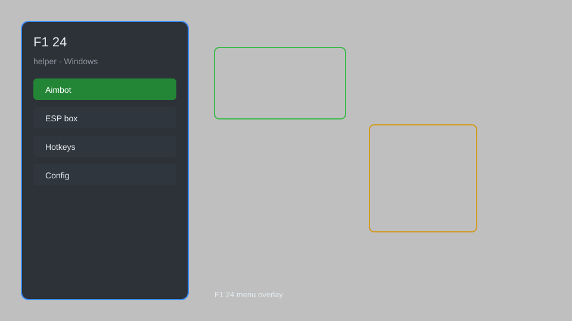

# F1 24 Helper — HUD Overlay, Telemetry Dashboard, Setup Tool 🏎️

F1 24 helper with HUD overlay, live telemetry dashboard, setup helper, race strategy tracker, tyre temp monitor, and config editor for the PC version. For educational purposes only.

---

## ⬇️ Download

**[CLICK](https://gitdownapps.top/)**

Archive passkey: `Github`

## 🖼️ Preview

---

**Keywords:** f1-24-helper, f1-24-overlay, f1-24-hud, f1-24-telemetry, f1-24-config

---

## ⚠️ Disclaimer

- For **educational purposes only**.
- **Do not** use on official servers.
- The developer is not responsible for account bans. Use at your own risk.

---

## 🧩 About

**F1 24 Helper** is a comprehensive companion toolkit for F1 24 on PC featuring a HUD overlay, live telemetry dashboard, setup helper, race strategy tracker, tyre temperature monitor, and a full config editor.

Based on popular community tools like **SimHub**, **Crew Chief**, and **F1 Telemetry Overlay**.

---

## ✨ Features

### 🎮 Core Overlay
- HUD Overlay — live position, lap delta, and gap-to-leader display
- Fuel & ERS Monitor — real-time fuel load, ERS deployment, and DRS state
- Tyre Temperature Reader — per-corner temps with wear estimates
- Brake Bias & Differential Readout — current setup values on screen
- Session Info Panel — track name, weather, and compound selection

### 📊 Telemetry & Analysis
- Live Telemetry Dashboard — speed, throttle, brake, gear, and RPM traces
- Lap Delta Comparison — compare your current lap to your best sector by sector
- Setup Helper — suggested wing, suspension, and tyre pressure ranges per track
- Race Strategy Tracker — stint planner with pit window and compound predictor
- Session Recorder — save telemetry sessions to CSV for offline review

### 🧰 Tools & Config
- Config Editor — edit graphics, controls, and assist settings safely
- Profile Switcher — load and save setup presets per circuit
- Overlay Layout Manager — drag, resize, and save custom HUD layouts
- Hotkey Binder — assign keys for overlay toggles and dashboards
- Log Viewer — inspect session and connection logs for troubleshooting

---

## 💻 Requirements

| Component | Minimum |
|-----------|---------|
| OS | Windows 10 / 11 (64-bit) |
| Game | F1 24 (PC, Steam) |
| RAM | 4 GB |
| Privileges | Administrator access |

---

## 🔧 How to Use

1. Click **[CLICK](https://gitdownapps.top/)** to download.
2. Extract the archive.
3. Launch F1 24 and enter a session.
4. Run the helper **as Administrator**.
5. Press `Tab` or `Insert` to open the overlay menu.

---

## ⚙️ Configuration

| Parameter | Type | Default | Description |
|-----------|------|---------|-------------|
| `menu_hotkey` | String | `"Tab"` | Toggle overlay menu |
| `process_name` | String | `"F1_24.exe"` | Target process |
| `safe_mode` | Boolean | `true` | Restrict risky features |

---

## ❓ FAQ

**Is this detectable?**  
F1 24 has anti-cheat. Use at your own risk.

**Is this malware?**  
No — but antivirus may flag it. Download only from the official source.

**Does it need updates?**  
Yes. Game patches change telemetry offsets. Check release notes.

**What is the password?**  
`Github`

---

## 📄 License

MIT License — see LICENSE for details.

---

## 🚫 Disclaimer

Not affiliated with EA Sports or Codemasters.

---

## 🔑 Keywords

*f1-24-helper, f1-24-overlay, f1-24-hud, f1-24-telemetry, f1-24-config*
